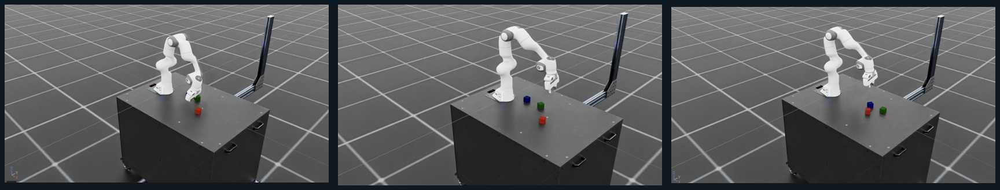
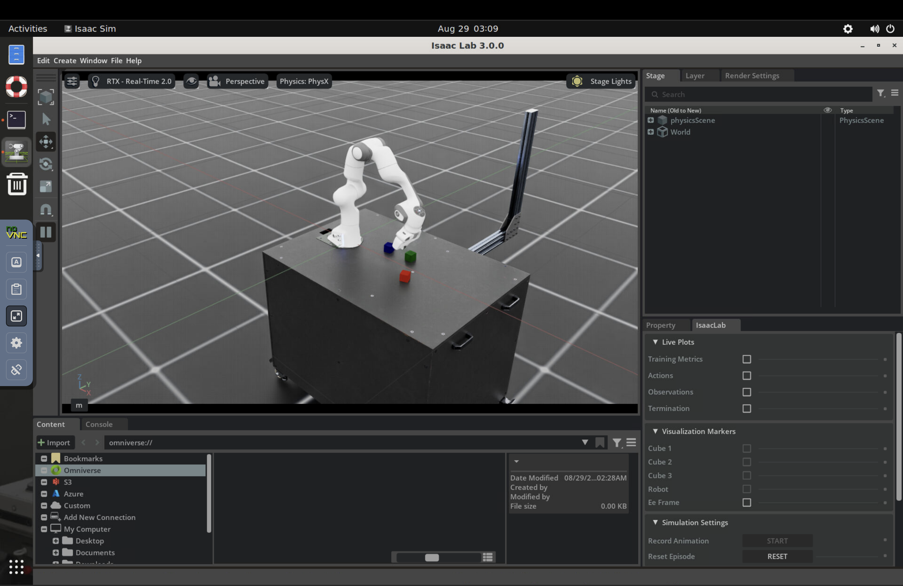

# Contact in Latent Space

### Learning to predict, imagine, and control contact-rich robot manipulation



*Cube-stacking experiments with a Franka Panda in Isaac Lab, using the simulation side of our JAX world-model pipeline.*



This is a deliberately small, self-contained Physical AI project: a planar end-effector pushes a cube toward a target, a learned action-conditioned latent dynamics model predicts what happens next, and a model-based controller plans inside that learned model. A random-data MLP world model is the star; the environment is deterministic, inspectable, and has no MuJoCo dependency.

## What this project is

This is a robot-learning research stack, not only an RL environment. It combines a fast Gymnasium toy environment, a robot demonstration dataset, a JAX action-conditioned world model, and planning/RL experiments that act inside the learned simulator. The NVIDIA SingleArm dataset is now the primary benchmark; the toy push task remains a minimal integration test.

## Why this matters

Contact-rich manipulation is hard because actions change the future through intermittent contact. A world model turns expensive real/environment interaction into reusable experience: learn a compact predictive state, imagine candidate futures, and improve a policy mostly in imagination. Those are core ingredients behind generalist robot policies (including π0-style systems), even though this repository intentionally uses a tiny state space rather than vision, language, or a large robot dataset.

## Quickstart

```bash
python -m venv .venv && source .venv/bin/activate
pip install -e '.[dev]'
python scripts/train_world_model.py --steps 1000 --seed 0
python scripts/train_mpc.py --model artifacts/world_model.pkl --episodes 30 --seed 0
python scripts/evaluate.py --controller mpc --episodes 20 --seed 0

# Benchmark and paper figures
python scripts/run_benchmark.py --seeds 0 1 2 --train-steps 0 250 1000 5000
python scripts/plot_results.py
python scripts/plot_rollout.py
```

The CPU-friendly smoke run uses a 32-dimensional latent state, short horizons, and a small replay buffer. For a meaningful comparison, use 10k–50k world-model updates and evaluate both `mpc` and `random`. Metrics should include success rate, environment steps, and prediction MSE across multiple seeds.

## Layout

* `ewm/env.py`: deterministic Gymnasium push task; low-dimensional observations and optional RGB rendering.
* `ewm/world_model.py`: Flax encoder + MLP latent transition/reward predictor, with a JITted Optax update.
* `ewm/replay.py`: seeded rollout collection and batch sampling.
* `ewm/planner.py`: random-shooting MPC with short imagined futures.
* `scripts/`: one-command training, planning, evaluation, benchmark, and plotting entry points.
* `reports/preprint.md`: a concise preprint-style template with claim boundaries.

## NVIDIA SingleArm real-data track

The primary data track now targets NVIDIA's `PhysicalAI-Robotics-Manipulation-SingleArm` dataset. It is an Isaac Sim-generated Franka Panda collection with six tasks, 53/81-dimensional state, 7/8-dimensional actions, RGB/depth cameras, and roughly 15.2 GB total. The first experiment deliberately downloads only Parquet state/action files and metadata; video is a later visual-model milestone. See the [dataset card](https://huggingface.co/datasets/nvidia/PhysicalAI-Robotics-Manipulation-SingleArm) for license and task details.

```bash
python scripts/download_single_arm.py --output data/single_arm
python scripts/inspect_single_arm.py data/single_arm
python scripts/train_real_world_model.py data/single_arm --max-rows 200000 --steps 2000
python scripts/benchmark_real_data.py data/single_arm/panda-stack-wide --episodes 10 --steps 300
python scripts/run_data_scaling.py data/single_arm/panda-stack-wide --episodes 10 25 50 100 --steps 500
```

The download script intentionally excludes MP4 videos. If the Hugging Face repository asks for authentication, accept the dataset terms in the browser and run `hf auth login` before retrying. Start with one task/shard if disk or bandwidth is limited; the full dataset is not required for the first result.

This real-data model predicts `observation.state[t+1]` from `observation.state[t]` and `action[t]`, with an episode-safe train/validation split. The first paper result should be a data-scaling curve of validation MSE versus number of transitions, followed by multi-step rollout error and task-specific held-out generalization. The original toy environment remains as a fast unit test, not the main scientific benchmark.

The learned-dynamics stage is available with:

```bash
python scripts/evaluate_rollouts.py artifacts/single_arm_absolute.pkl data/single_arm/panda-stack-wide
python scripts/evaluate_model_env.py artifacts/single_arm_absolute.pkl data/single_arm/panda-stack-wide
python scripts/evaluate_model_env.py artifacts/single_arm_absolute.pkl data/single_arm/panda-stack-wide --controller random
python scripts/train_behavior_cloning.py data/single_arm/panda-stack-wide --episodes 100 --steps 2000
python scripts/evaluate_policy.py artifacts/single_arm_bc.pkl artifacts/single_arm_100ep.pkl data/single_arm/panda-stack-wide
```

## Local UI

Install the optional dashboard dependency and launch the experiment viewer:

```bash
pip install -e '.[ui]'
streamlit run scripts/dashboard.py
```

The dashboard shows the downloaded dataset schema, model/data-scaling curves, multi-step rollout error, policy comparisons, and generated figures. It reads files under `artifacts/` and refreshes when you rerun experiments.

The visual tab previews downloaded world-camera and wrist-camera MP4 samples. To fetch two small samples without downloading the full video corpus:

```bash
.venv/bin/hf download nvidia/PhysicalAI-Robotics-Manipulation-SingleArm \
  --repo-type dataset --include 'panda-stack-wide/videos/chunk-000/observation.images.*_camera/episode_00000[01].mp4' \
  --local-dir data/single_arm
```

The first command measures compounding 1/5/10-step prediction error. The second launches a goal-conditioned Gymnasium environment whose transitions are generated by the learned model and whose initial states/goals come from demonstration episodes. This is a research simulator for offline/model-based RL, not a replacement for Isaac Sim or physical-robot safety validation.

The first learned-simulator policy smoke test, using five episodes and ten model steps, produced mean dense returns of `-0.0914` random, `-0.0561` behavior cloning, and `-0.0277` CEM. Sparse success was still zero for all methods; longer horizons, better model calibration, and task-specific rewards are required next.

For `panda-stack-wide`, the task-aware benchmark now defines success as box 0 being horizontally within 6 cm of box 1 with a vertical gap between 3 and 9 cm. State indices are taken from the dataset metadata: box 0 is state dimensions 0–2 and box 1 is 14–16.

## Benchmark metrics

The benchmark logs task success, mean and standard-deviation return, final cube-target distance, episode length, contact rate, environment seed, training updates, and held-out one-step model MSE. The most useful first figure is success rate and final distance for world-model MPC versus random across seeds. Pass several `--train-steps` values (for example 0, 250, 1000, 5000) in one run to create a sample-efficiency table.

The initial small run is retained as a debugging checkpoint. The current reproducible candidate benchmark uses 1,000 random replay episodes, 10,000 JAX updates, 128 CEM candidates, horizon 8, 50 evaluation episodes, and five seeds. It measured 0.0% random success, 100.0% scripted-reference success, and 25.6% ± 24.4% world-model MPC success. The per-seed MPC success rates were 0%, 54%, 0%, 38%, and 36%; the next benchmark should reduce this variance with more data and seeds.

## Long-horizon task-aware result

After vectorizing CEM candidate evaluation, the learned Panda stacking simulator was evaluated for 10 episodes, 50 control steps, 128 candidates, and 4 CEM iterations. CEM success increased with planning horizon: 30% at horizon 4, 60% at horizon 10, and 80% at horizon 20. Random achieved 20% and behavior cloning 0% under the same learned-simulator protocol. The tracked result table is [reports/long_horizon_results.csv](reports/long_horizon_results.csv).

## Minimal compute and honest scope

On CPU, the credible first milestone is a stable next-state prediction loss and an MPC controller that beats random exploration on this toy task. A laptop should handle smoke tests and small experiments in minutes; a GPU makes 10k–100k updates practical. Do not claim broad robot generalization from this benchmark: report seeds, prediction MSE, model/planner horizons, and environment steps.

## Isaac Lab handoff

The local benchmark is complete through offline model-based RL. The exact
SingleArm Panda state/action ordering and stacking thresholds are locked in
[`ewm/isaac_bridge.py`](ewm/isaac_bridge.py) and
[`configs/single_arm_isaac_contract.json`](configs/single_arm_isaac_contract.json).
Run the preflight before moving to an Isaac machine:

```bash
python scripts/preflight_isaac.py
```

The remaining implementation is a thin Isaac Lab `DirectRLEnv`: instantiate
the Panda and two cubes, route the 7-D end-effector delta action through Isaac
Lab's controller, emit the 53 state values, and reuse the existing stacking
metric. See [`isaaclab_extension/README.md`](isaaclab_extension/README.md).
Isaac Sim is not expected to run on this macOS development host; use a
Linux/Windows NVIDIA RTX workstation or cloud GPU for that final validation.

## Stretch goals

1. Pixel observations and a convolutional encoder (64×64).
2. CEM or Dreamer-style actor-critic imagination.
3. PPO/SAC as a true model-free baseline and success-vs-steps curves.
4. Multi-task target/object variation and language conditioning (“push left”, “push right”).
5. MuJoCo validation after the pure-NumPy version is understood.

## Reproducibility

All scripts accept a seed and write JSON metrics plus a pickle checkpoint under `artifacts/`. `configs/default.yaml` records the canonical experiment settings. The transition function is pure NumPy and the JAX training step follows the explicit `value_and_grad -> optax.update -> apply_updates` pattern used in the local scaling-laws project.
