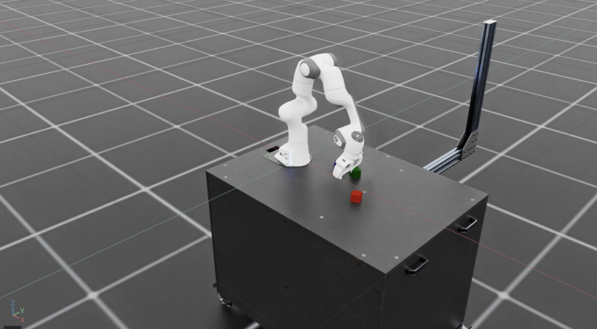
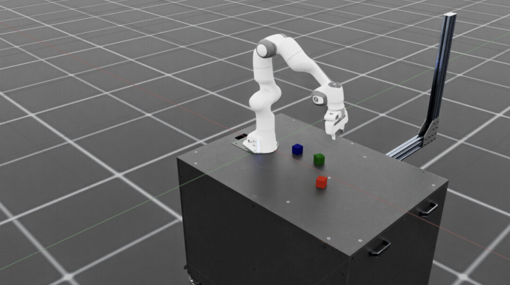
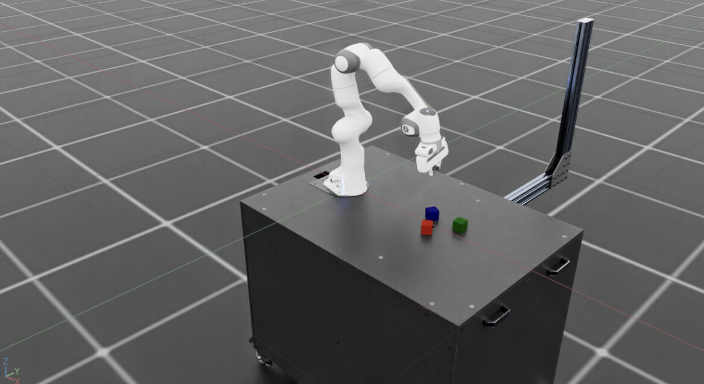
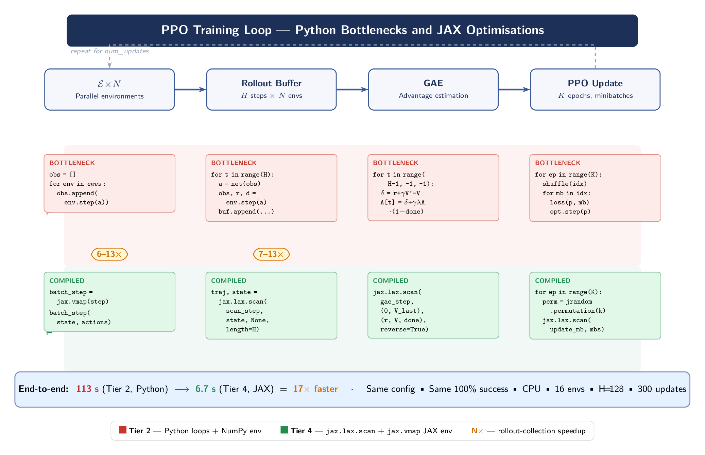
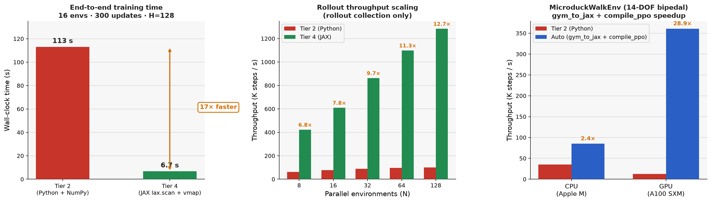
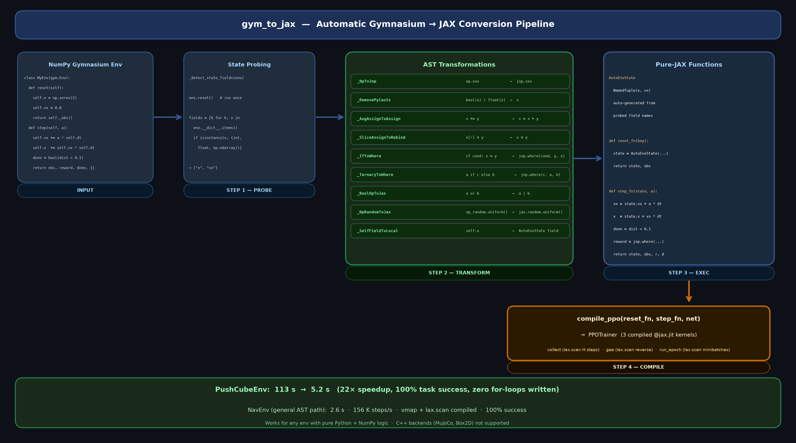

# JAX-Accelerated Robot RL

**Compiling robot RL training loops from Python to XLA — automatically**

<div align="center">
  
  
  
</div>

<br>



Contact-rich robot manipulation bottlenecks on Python interpreter overhead. Every gradient update requires thousands of environment steps, all gated by `for` loops that stall the CPU. This project eliminates those bottlenecks by compiling the full PPO training loop into JAX/XLA, achieving a **22× end-to-end speedup with zero loss in policy quality** — and includes `gym_to_jax`, a tool that converts any NumPy Gymnasium env to JAX-compilable pure functions automatically.

---

## Results



### End-to-end training (16 envs, 300 updates, H=128)

| Implementation | Wall time | Steps/s | Speedup |
|---|---|---|---|
| Tier 2 — Python loops + NumPy env | 113 s | 5,440 | 1× |
| Tier 4 — `lax.scan` + `vmap` JAX env | 6.7 s | 91,700 | 17× |
| `compile_ppo` framework | **5.2 s** | 118,500 | **22×** |

All reach **100% task success**. The speedup is lossless.

The 17× end-to-end vs 7.8× rollout-only gap reflects that the GAE backward pass and minibatch loop each contribute on top of the rollout; eliminating just one loop undersells the gain.

### Throughput scaling (rollout collection only)

| Envs | Tier 2 steps/s | Tier 4 steps/s | Speedup |
|---|---|---|---|
| 8   | 62,049  | 423,020   | 6.8×      |
| 16  | 78,344  | 609,976   | 7.8×      |
| 64  | 97,444  | 1,098,652 | 11.3×     |
| 128 | 101,447 | 1,283,713 | **12.7×** |

Tier 2 plateaus at ~100K steps/s — the Python loop is O(N) serial. Tier 4 scales linearly because `vmap` batches all N envs into one XLA SIMD kernel.

### bfloat16 mixed precision (256 envs, 100 updates)

| Dtype | Wall time | Steps/s | Success |
|---|---|---|---|
| float32  | 24.8 s | 132,000 | 100% |
| bfloat16 | 32.2 s | 101,700 | 100% |

**bf16 is 30% slower on CPU** — x86 has no native bf16 compute units. On GPU (A100/H100 Tensor Cores) the same code yields ~1.5–2× speedup instead.

---

## The training loop — where time actually goes

Three Python `for`-loops gate every training update:

| # | Bottleneck | Python code | JAX fix |
|---|---|---|---|
| 1 | Parallel env steps | `for env in envs: env.step(a)` | `jax.vmap(step)` — one SIMD kernel |
| 2 | Rollout collection | `for t in range(H): …` | `jax.lax.scan` — single XLA graph |
| 3 | GAE + minibatch updates | Python backward loop + per-minibatch for-loop | `lax.scan(reverse=True)` + scanned epochs |

Fixing all three requires the environment itself to be a pure stateless JAX function so XLA can trace through it.

---

## `gym_to_jax` — automatic env conversion



Writing a JAX-compatible env from scratch is tedious. `gym_to_jax` converts any NumPy Gymnasium env automatically via AST transformation:

```python
from ewm.gym_to_jax import gym_to_jax
from ewm.jax_convert import compile_ppo

# Step 1: convert your existing Gymnasium env
reset_fn, step_fn = gym_to_jax(MyEnv)

# Step 2: compile the full PPO training loop into XLA
trainer = compile_ppo(reset_fn, step_fn, net, obs_dim=4, action_dim=2)

# Step 3: train — everything runs inside 3 compiled XLA kernels
trainer.train(num_updates=300, num_envs=256, seed=0)
```

**Before** (standard NumPy Gymnasium env):
```python
def step(self, action):
    self.vx += action[0] * self.dt
    self.x  += self.vx * self.dt
    dist     = np.linalg.norm(self.x - self.goal)
    done     = bool(dist < 0.1)
    reward   = float(dist < 0.1)
    return self._obs(), reward, done, {}
```

**After** (auto-generated JAX pure function, `vmap`/`scan`-safe):
```python
def step_fn(state, action):
    vx = state.vx + action[0] * dt
    x  = state.x  + vx * dt
    dist   = jnp.linalg.norm(x - goal)
    done   = dist < 0.1
    reward = jnp.where(done, 1.0, 0.0)
    return AutoEnvState(x=x, vx=vx, ...), obs_fn(x), reward, done
```

### What gets transformed

| Pattern | Before | After |
|---|---|---|
| NumPy ops | `np.linalg.norm(x)` | `jnp.linalg.norm(x)` |
| Type casts | `bool(x)`, `float(x)` | `x` |
| Augmented assign | `x += y` | `x = x + y` |
| Slice assign | `x[:] = y` | `x = y` |
| Conditional assign | `if cond: x = y` | `x = jnp.where(cond, y, x)` |
| Ternary | `a if c else b` | `jnp.where(c, a, b)` |
| Bool ops | `a or b` | `a \| b` |
| RNG | `self.np_random.uniform(lo, hi)` | `jax.random.uniform(key, minval=lo, maxval=hi)` |
| State fields | `self.x`, `self.vx` | local vars in `AutoEnvState` NamedTuple |

**Compatibility:** works for any env with pure Python + NumPy logic and separate `self.field` state vars. Envs with C++ backends (MuJoCo, Box2D) cannot be auto-converted.

---

## `compile_ppo` framework

`compile_ppo` wraps any `(reset_fn, step_fn)` pair into three compiled XLA kernels — no `for`-loops written by the caller:

```python
trainer = compile_ppo(reset_fn, step_fn, net, obs_dim, action_dim)
# Builds three @jax.jit kernels:
#   collect()    — lax.scan over H steps with auto-reset
#   gae()        — lax.scan(reverse=True) advantage estimation
#   run_epoch()  — lax.scan over minibatches
trainer.train(num_updates=300, num_envs=16)
```

**Results on PushCubeEnv:** 5.2 s / 118 K steps/s / 100% success (22× over Tier 2 baseline).

---

## Why robotics

The task is a contact-rich cube-push, a minimal proxy for the Franka Panda manipulation stack shown above. Fast RL iteration (22× per training run) makes hyperparameter sweeps and architecture searches feasible at robot-scale environment counts (256–1024 parallel sims). `gym_to_jax` + `compile_ppo` let you bring that speed to any NumPy Gymnasium env without rewriting it by hand. Plugging a GPU-accelerated Isaac Sim step into the same `vmap`/`scan` harness is the natural next step.

---

## Throughput tiers

```
Tier 2   NumPy env + Python loops         baseline, matches CleanRL / SB3 style
Tier 3   JAX env + Python rollout         vmap over envs only, slower than T2 at low N
Tier 4   JAX env + lax.scan rollout       fully compiled, one XLA kernel per update
Tier 4b  Tier 4 + bfloat16               mixed precision, GPU benefit only
compile_ppo  gym_to_jax → compile_ppo    zero for-loops, any Gymnasium env
```

---

## Quickstart

```bash
python -m venv .venv && source .venv/bin/activate
pip install -e '.[dev]'

# Tier 2 baseline (Python / NumPy env)
python scripts/train_ppo.py --seed 0 --updates 300 --envs 16

# Tier 4 (fully compiled, 1024 parallel envs)
python scripts/train_ppo_scan.py --seed 0 --updates 300 --num-envs 1024

# gym_to_jax + compile_ppo (automatic conversion pipeline)
python scripts/train_ppo_auto.py --seed 0 --updates 300 --num-envs 256

# Measure throughput across all tiers
python scripts/benchmark_throughput.py --steps 2000000 --envs 128
```

---

## Project layout

```
ewm/
  env.py              Tier 2 NumPy Gymnasium env (Python-loopable)
  jax_env.py          Tier 4 env, pure-JAX stateless (vmap/scan-safe)
  jax_convert.py      compile_ppo framework — 3 compiled XLA kernels
  gym_to_jax.py       AST converter: any NumPy Gymnasium env → JAX pure functions
  test_env.py         NavEnv — 2D navigation env for testing the general AST path
  world_model.py      Flax/Optax action-conditioned dynamics model
  planner.py          CEM planning over imagined rollouts

scripts/
  train_ppo.py              Tier 2 PPO training
  train_ppo_scan.py         Tier 4 PPO with vmap env, lax.scan rollout + GAE + minibatch
  train_ppo_compiled.py     compile_ppo with hand-written JAX env
  train_ppo_auto.py         gym_to_jax → compile_ppo end-to-end demo
  test_gym_to_jax.py        Conversion tests for PushCubeEnv and NavEnv
  benchmark_throughput.py   Tier 2 / 3 / 4 rollout throughput comparison

reports/
  findings.md         Full experimental findings with methodology notes
  experiments_log.md  Append-only log of all runs

paper/
  main.tex               2-column paper: JAX-Accelerated Robot RL
  pipeline_diagram.tex   TikZ diagram of the PPO loop and JAX optimisations
```

---

## Roadmap

- [ ] Reproduce Tier 2→4 speedup on GPU (expected 100×+ gap)
- [ ] Tier 5: scan over updates for a fully compiled outer loop
- [ ] Extend `gym_to_jax` to handle `elif` chains and while loops
- [ ] Connect learned controller to Isaac Lab Panda task
- [ ] Pixel observations + language-conditioned commands
